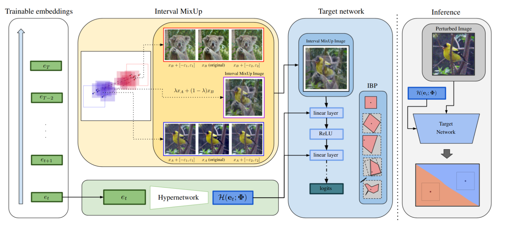

# 🛡️ SHIELD: Secure Hypernetworks for Incremental Expansion Learning Defense

**Authors**: Patryk Krukowski, Łukasz Gorczyca, Piotr Helm, Kamil Książek, Przemysław Spurek  
🎓 *GMUM — Jagiellonian University*

📄 **[Read the full paper on arXiv](https://arxiv.org/abs/2506.08255)**  



#### What is the goal of SHIELD?

Continual learning under adversarial conditions remains an open problem, as existing methods often compromise either robustness, scalability, or both. We propose a novel framework that integrates **Interval Bound Propagation (IBP)** with a **hypernetwork-based architecture** to enable **certifiably robust continual learning** across sequential tasks.

**SHIELD** generates task-specific model parameters via a shared hypernetwork conditioned solely on compact task embeddings, eliminating the need for replay buffers or full model copies and enabling efficient over time. To further enhance robustness, we introduce **Interval MixUp**, a novel training strategy that blends virtual examples represented as $\ell_{\infty}$ balls centered around MixUp points. Leveraging interval arithmetic, this technique guarantees certified robustness while mitigating the wrapping effect, resulting in smoother decision boundaries.

#### Why would I use SHIELD?

SHIELD is evaluated under strong white-box adversarial attacks, including PGD and AutoAttack, across multiple benchmarks. It consistently outperforms existing robust continual learning methods, achieving state-of-the-art Average Accuracy while maintaining both scalability and certification. These results represent a significant step toward practical and theoretically grounded continual learning in adversarial settings.

---

## 🧭 Table of Contents

- [Benchmarks](#benchmarks)
- [Method Overview](#method-overview)
- [Robustness Evaluation](#robustness-evaluation)
- [Getting Started](#getting-started)
  - [Setup](#setup)
  - [Launching Experiments](#launching-experiments)
  - [Running Sweeps](#running-sweeps)
- [Acknowledgements](#acknowledgements)
- [License](#license)
- [Citation](#citation)
- [Contact](#contact)

---

## 📈 Benchmarks

We evaluate SHIELD on a diverse set of benchmarks:

|Dataset|No. tasks|No. classes per task|
|------------------|--|--|
|Permuted MNIST    |10|10|
|Rotated MNIST     |10|10|
|Split CIFAR-100   |10|10|
|Split miniImageNet|10|5|
|TinyImageNet      |40|5 |

SHIELD achieves **state-of-the-art or highly competitive performance**, sometimes **doubling the robust accuracy** of prior methods under strong attacks such as **AutoAttack**. These results underscore the scalability and effectiveness of our approach for real-world, adversarially robust continual learning.

---

## 🧪 Method Overview

SHIELD integrates three key components:

1. **Hypernetwork-based continual learning**  
   Learns task-specific weights through a shared hypernetwork without storing previous data or models.

2. **Interval Bound Propagation (IBP)**  
   Enables certified robustness by computing bounds on adversarial perturbations using interval arithmetic.

3. **Interval MixUp (IM)**  
   A novel strategy that mixes intervals of different samples to generate provably robust synthetic data, improving generalization and certification.

The architecture and training loop are designed to be **modular, scalable**, and compatible with **PyTorch Lightning + Hydra** for flexible configuration and reproducibility.

---

## 🔐 Robustness Evaluation (Task-Incremenal Learning)

- Evaluated under **[AutoAttack](https://arxiv.org/abs/1909.08383)**, **[PGD](https://arxiv.org/abs/1706.06083)**, **[FGSM](https://arxiv.org/pdf/1412.6572)**, and on original samples.
- SHIELD with **Interval MixUp** improves certified accuracy while maintaining low forgetting.
- Outperforms all baselines in average robust accuracy and BWT -- backward transfer (on original samples) across all benchmarks.

**Permuted MNIST**

|Method| AutoAttack | PGD | FGSM | Original samples | BWT |
|------|---|---|---|---|---|
|SGD | 14.1 | 15.4 | 21.8 | 36.8 | -0.66 |
|SI | 14.3 | 16.5 | 22.3 | 36.9 | -0.67 |
|A-GEM | 14.1 | 19.7 | 22.9 | 48.4 | -0.54 |
|EWC | 39.4 | 43.1 | 50.0 | 84.9 | -0.12 |
|GEM | 12.1 | 75.5 | 72.8 | 96.4 | -0.01 |
|OGD | 19.7 | 24.1 | 26.0 | 46.8 | -0.57 |
|GPM | 70.4 |  72.9 | 65.7 | 97.2 | -0.01 |
|DGP | **81.6** | 81.2 | 75.8 | 97.6 | -0.01 |
|**SHIELD** | 80.91 | 90.11 | 78.87 | 93.58 | **0.02** | 
|**SHIELD-IM**| 80.08 | **97.44** | **79.09** | **97.96** | -0.05 |

**Rotated MNIST**

|Method| AutoAttack | PGD | FGSM | Original samples | BWT |
|------|---|---|---|---|---|
|SGD | 14.1 | 9.9 | 20.4 | 32.3 | -0.71 |
|SI | 13.9 | 15.3 | 20.1 | 33.0 | -0.72 |
|A-GEM | 14.1 | 21.6 | 24.8 | 45.4 | -0.57 |
|EWC | 45.1 | 49.5 | 46.5 | 80.7 | -0.18 |
|GEM | 11.9 | 76.5 | 74.4 | 96.7 | -0.01 |
|OGD | 19.7 | 23.8 | 23.8 | 48.0 | -0.557 |
|GPM | 68.8 | 71.5 | 65.9 | 97.1 | -0.01 |
|DGP | 81.6 | 82.6 | 78.6 | 98.1 | **-0.00** |
|**SHIELD** | **85.64** | 92.94 | **83.82** | 95.62 | -0.03 | 
|**SHIELD-IM**| 82.91 | **97.88** | 83.03 | **98.32** | -0.08 |

**Split CIFAR-100**

|Method| AutoAttack | PGD | FGSM | Original samples | BWT |
|------|---|---|---|---|---|
|SGD | 10.3 | 12.8 | 19.4 | 46.5 | -0.49 |
|SI | 13.0 | 15.2 | 19.8 | 45.4 | -0.48 |
|A-GEM | 12.6 | 12.9 | 20.7 | 40.6 | -0.48 |
|EWC | 12.6 | 23.2 | 30.5 | 56.8 | -0.35 |
|GEM | 21.2 | 19.4 | 47.7 | 60.6 | -0.13 |
|OGD | 11.8 | 14.1 | 18.9 | 44.2 | -0.50 |
|GPM | 34.4 | 36.6 | **53.7** | 58.2 | **-0.10** |
|DGP | 36.6 | 39.2 | 48.0 | 67.2 | -0.13 |
| **SHIELD** | 60.91 | 59.77 | 45.37 | 64.24 | -0.34 |
| **SHIELD-IM** | **63.08** | **62.39** | 46.48 | **67.45** | -0.41 |

**Split miniImageNet**

| Method        | AutoAttack | PGD       | FGSM     | Original samples | BWT       |
| ------------- | ---------- | --------- | -------- | ---------------- | --------- |
| SGD           | 20.5       | 22.0      | 23.5     | 30.8             | -0.24     |
| SI            | 20.4       | 21.3      | 22.7     | 28.1             | -0.27     |
| A-GEM         | 19.0       | 19.8      | 21.2     | 29.2             | -0.28     |
| EWC           | 21.3       | 22.7      | 24.3     | 29.9             | -0.25     |
| GEM           | 22.3       | 23.8      | 25.4     | 31.8             | -0.20     |
| OGD           | 17.9       | 18.8      | 20.7     | 29.6             | -0.29     |
| GPM           | 26.3       | 27.1      | 28.8     | 36.8             | -0.12     |
| DGP           | 32.1       | 33.8      | 35.5     | 44.8             | **-0.05** |
| **SHIELD**    | 56.22      | 56.8      | 53.08    | 59.52            | -0.16     |
| **SHIELD-IM** | **57.9**   | **58.47** | **54.1** | **62.67**        | -0.18     |


---

## ⚙️ Getting Started

### 🛠️ Setup

1. **Clone the repository**  
   ```bash
   git clone https://github.com/pkrukowski1/SHIELD
   cd SHIELD

2. **Create and activate the conda environment**
   ```bash
   conda env create -f environment.yml
   conda activate shield
   ```

3. **Install remaining Python packages**
   ```bash
   pip install -r requirements.txt
   ```

4. Configure environment variables
   ```bash
   cp example.env .env
   # Edit `.env` to configure WANDB, dataset paths, etc.
   ```

### 🚀 Launching Experiments

To launch a default experiment with Hydra:
   ```bash
   WANDB_MODE=offline HYDRA_FULL_ERROR=1 python src/main.py --config-name=config
   ```
   > 💡 Use WANDB_MODE=online to enable live logging to Weights & Biases

You can also launch predefined experiments for specific datasets:
   ```bash
   # For Permuted MNIST
   ./scripts/permuted_mnist/train/train.sh

   # For Rotated MNIST
   ./scripts/rotated_mnist/train/train.sh

   # For Split CIFAR-100
   ./scripts/split_cifar_100/train/train.sh

   # For Split miniImageNet
   ./scripts/split_mini_imagenet/train/train.sh

   # For TinyImageNet
   ./scripts/tiny_imagenet/train/train.sh
   ```

---

## 🙏 Acknowledgements

- Project structure adapted from [Bartłomiej Sobieski’s template](https://github.com/sobieskibj/templates/tree/master)
- Inspired by and built upon [HyperMask](https://github.com/gmum/HyperMask)

---

## 📜 License

This project is licensed under the MIT License. See [LICENSE](./LICENSE) for more information.

---

## 📚 Citation

If you use this work in your research, please cite:

```bibtex
@misc{krukowski2025shieldsecurehypernetworksincremental,
      title={SHIELD: Secure Hypernetworks for Incremental Expansion Learning Defense}, 
      author={Patryk Krukowski and Łukasz Gorczyca and Piotr Helm and Kamil Książek and Przemysław Spurek},
      year={2025},
      eprint={2506.08255},
      archivePrefix={arXiv},
      primaryClass={cs.LG},
      url={https://arxiv.org/abs/2506.08255}, 
}
```

---

## ✉️ Contact
Questions, suggestions or issues?  
Open an issue or contact the authors directly via [GMUM](https://gmum.net/).
